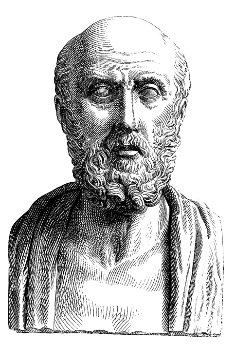
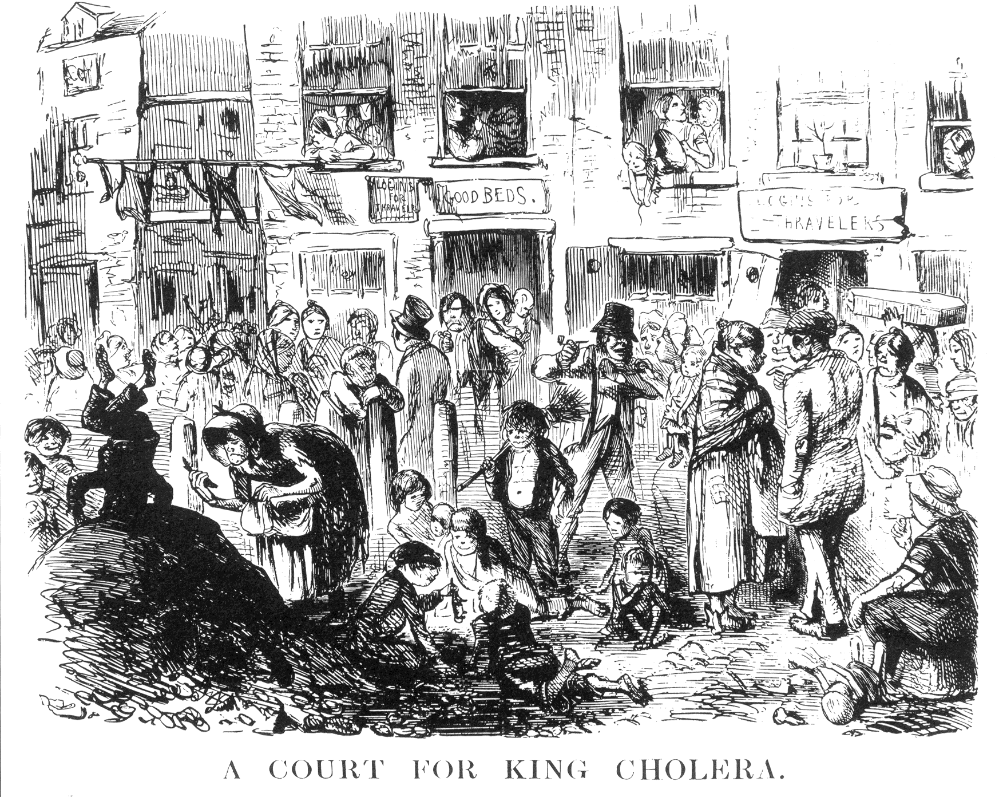
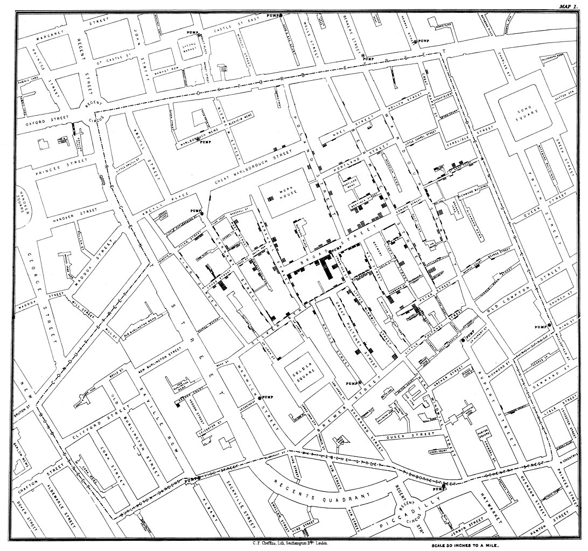

# Pekan 1

Ini adalah materi pekan 1: Berpikir epidemiologis

**Apa konsep paling awal yang perlu saya pahami?**

Semua makhluk hidup bisa terganggu kesehatannya dan menjadi sakit. Pada umumnya, penyakit tidak muncul secara acak, tetapi mengikuti pola tertentu. Dengan mengamati dan menganalisis pola-pola ini, kita dapat mencegah dan/atau mengendalikan penyakit. 

Secara sederhana, epidemiologi adalah yang ilmu mempelajari bagaimana penyakit-penyakit muncul dan menyebar di dalam populasi dan bagaimana cara mengendalikannya. Dalam epidemiologi veteriner, populasi yang dipelajari adalah sekelompok hewan, bukan hanya hewan secara individual.

Bayangkan Anda bekerja di peternakan yang memiliki 100 ekor sapi perah. Dalam seminggu terakhir, 10 sapi mengalami diare dan penurunan produksi susu. Anda mungkin berpikir:
- "Apakah ini hanya kebetulan?" 
- "Apakah ada pola tertentu?"
- "Apa kesamaan yang dimiliki oleh sapi-sapi yang sakit?"
- "Mengapa 10 ekor sapi ini dan bukan 90 ekor sapi lainnya?"

Dengan pendekatan epidemiologis, Anda tidak berfokus pada seekor hewan, tetapi menyelidiki suatu populasi. 

Sebelum melangkah lebih jauh, Anda perlu memahami bahwa kondisi kesehatan dan penyakit memiliki pola yang dapat dipelajari.

---

**Definisi komprehensif**

Ada banyak definisi epidemiologi. Namun, salah satu definisi yang komprehensif dan banyak digunakan yaitu:

> Epidemiologi adalah studi ilmiah mengenai distribusi dan determinan dari kondisi atau peristiwa yang berhubungan dengan kesehatan pada populasi yang spesifik dan penerapan studi ini untuk mengendalikan masalah kesehatan.

Ada beberapa kata dan frasa kunci dalam definisi tersebut.
1. Distribusi
2. Determinan
3. Kondisi atau peristiwa yang berhubungan dengan kesehatan
4. Populasi
5. Penerapan

Mari kita bahas satu per satu.

- **Kondisi atau peristiwa yang berhubungan dengan kesehatan**  
  Epidemiologi tidak hanya mempelajari penyakit (misalnya penyakit menular dan tidak menular), tetapi juga mencakup berbagai kondisi, seperti cedera, malnutrisi, dan kebuntingan; dan berbagai peristiwa, seperti keracunan pakan, penurunan produksi telur atau susu, dan kematian mendadak.

- **Distribusi** 
  Distribusi menjelaskan kondisi atau peristiwa kesehatan berdasarkan karakteristik subjek (siapa yang terdampak), tempat (di mana ia terjadi), dan waktu (kapan ia terjadi). Sebagai contoh, apakah kasus lebih banyak terjadi pada musim hujan, di kota besar, atau pada jenis hewan tertentu seperti kuda pacu. Pemahaman mengenai distribusi membantu memahami pola penyebaran suatu kondisi atau peristiwa kesehatan.

- **Determinan** 
  Determinan merupakan faktor yang memengaruhi kesehatan hewan. Ia dapat berupa unsur genetik, pakan, sanitasi lingkungan, sistem pemeliharaan, atau keberadaan vektor serangga. Pemahaman mengenai determinan membantu dalam mencari tahu apa penyebab atau pemicu suatu kondisi atau peristiwa kesehatan.

- **Populasi** 
  Populasi merujuk pada kelompok hewan yang menjadi fokus kajian. Individu-individu hewan yang memiliki kesamaan karakteristik tertentu digolongkan sebagai populasi, misalnya gajah yang lahir pada tahun tertentu, kambing di sebuah desa, atau anjing jalanan di suatu kota. 

- **Penerapan** 
  Penerapan berarti menggunakan hasil kajian epidemiologi untuk mencegah dan mengendalikan masalah kesehatan serta meningkatkan status kesehatan populasi. Contohnya membuat program vaksinasi massal, meningkatkan kebersihan kandang, atau membatasi lalu lintas hewan untuk mencegah penyebaran penyakit.

---

**Asal kata**

Epidemiologi berasal dari bahasa Yunani, yang terdiri dari tiga akar kata utama: *epi* (di atas atau pada), *demos* (rakyat atau populasi), dan *logos* (ilmu atau studi). Secara harfiah, epidemiologi berarti "ilmu tentang sesuatu yang terjadi pada populasi." 

Epidemiologi juga dapat dimaknai sebagai ilmu yang mempelajari epidemi. Kata ini berasal dari bahasa Yunani *epidemios*, yang berarti 'tersebar dalam populasi.' 

Hippokrates, seorang tabib Yunani Kuno yang dikenal sebagai "Bapak Kedokteran," adalah orang pertama yang menggunakan kata epidemi dalam konteks kesehatan. Ia menggunakan istilah *epidemios* untuk merujuk pada sekumpulan sindrom fisik yang beredar dan menyebar dalam suatu populasi manusia pada waktu tertentu. 

<figure style="text-align: center;">
  
  <figcaption>Hippokrates, tokoh yang menggunakan kata epidemi dalam konteks kesehatan. Sumber gambar: <a href="https://commons.wikimedia.org/wiki/File:Hippocrates.jpg" target="_blank" rel="noopener noreferrer">Wikimedia Commons</a>.</figcaption>
</figure>

Sejak zaman peradaban kuno, ada dua istilah yang menggambarkan situasi penyakit dalam suatu populasi: epidemi dan endemi.

**Epidemi** berasal dari *epi-* (di atas) dan *demos* (populasi). Artinya, kondisi saat suatu penyakit “mengunjungi” populasi. Istilah ini digunakan ketika suatu penyakit muncul dan menyebar dengan cepat dalam suatu populasi dan jumlahnya melampaui angka yang biasanya diprediksi dalam periode waktu tertentu. 

Di sisi lain, **endemi** berasal dari *en-* (di dalam) dan *demos* (populasi). Artinya, kondisi saat suatu penyakit "mendiami" populasi. Istilah ini digunakan ketika suatu penyakit selalu ada dalam suatu populasi dengan tingkat kejadian yang relatif stabil dan dapat diprediksi. 

Sebagai contoh, rabies adalah penyakit endemik di beberapa wilayah tropis, sedangkan flu burung dapat menjadi epidemi ketika terjadi peningkatan kasus yang signifikan di luar pola normalnya.

---

**Penggambaran penyakit dalam populasi**

Selain epidemi dan endemi, ada beberapa istilah lain yang sering digunakan untuk menggambarkan situasi penyakit dalam populasi, seperti hiperendemi, wabah, pandemi, dan sporadik.

- **Hiperendemi** adalah situasi ketika suatu penyakit terus-menerus ada dalam suatu populasi dengan tingkat kejadian yang tinggi dan stabil dalam jangka waktu lama. Artinya, kasus penyakit muncul secara rutin seperti endemi, dengan jumlah yang tinggi. Contohnya adalah malaria yang secara konsisten terjadi dalam angka tinggi di beberapa daerah tropis sepanjang tahun.

- **Wabah** mengacu pada peningkatan kasus suatu penyakit di suatu wilayah tertentu dalam waktu yang relatif singkat, sering kali dalam skala yang lebih kecil dibandingkan dengan epidemi. Contoh wabah adalah peningkatan mendadak kasus leptospirosis setelah banjir di suatu daerah. 

- **Pandemi** adalah epidemi yang terjadi dalam skala global atau lintas benua, seperti pandemi Covid-19 yang menyebar ke hampir seluruh negara di dunia. 

- **Sporadik** merujuk pada kasus penyakit yang muncul secara acak atau tidak teratur tanpa pola yang jelas, seperti kasus antraks pada hewan yang kadang-kadang muncul di daerah tertentu tanpa kejadian yang meluas.

Meskipun istilah wabah dan epidemi sering dianggap sama dan digunakan secara bergantian, keduanya memiliki perbedaan dalam cakupan luasnya. Wabah biasanya mengacu pada kejadian yang lebih terbatas dalam skala wilayah tertentu, seperti di satu desa, kota, atau komunitas tertentu. Sementara itu, epidemi menggambarkan penyebaran penyakit dalam wilayah yang lebih luas dan sering kali berdampak pada sejumlah besar individu dalam suatu populasi. Contoh perbedaan ini dapat dilihat pada kasus flu babi (H1N1) yang dimulai sebagai wabah di daerah tertentu sebelum berkembang menjadi epidemi dan akhirnya menjadi pandemi. 

---

**Sejarah**

Prinsip-prinsip epidemiologi telah diterapkan sejak zaman Yunani Kuno, seperti konsep bahwa penyakit muncul akibat interaksi antara manusia dan lingkungan. Namun, julukan "Bapak epidemiologi modern" diberikan kepada John Snow, seorang dokter asal Inggris yang hidup pada abad ke-19.

<figure style="text-align: center;">
  
  <figcaption>John Snow, tokoh yang dianggap sebagai Bapak Epidemiologi Modern. Sumber gambar: <a href="https://commons.wikimedia.org/wiki/File:John_Snow.jpg" target="_blank" rel="noopener noreferrer">Wikimedia Commons</a>.</figcaption>
</figure>

Pada tahun 1854, London mengalami wabah kolera yang sangat mematikan. Pada saat itu, penyebab penyakit ini belum diketahui secara pasti. Teori dominan yang berkembang adalah teori miasma yang menyatakan bahwa penyakit menular disebarkan melalui udara yang terkontaminasi oleh miasma, partikel kecil yang juga mengakibatkan bau busuk. Namun, John Snow memiliki hipotesis berbeda. Ia mencurigai bahwa penyebaran kolera berkaitan dengan konsumsi air yang terkontaminasi.

<figure style="text-align: center;">
  
  <figcaption>Situasi wabah kolera di Inggris pada abad ke-19. Sumber gambar: <a href="https://commons.wikimedia.org/wiki/File:Punch-A_Court_for_King_Cholera.png" target="_blank" rel="noopener noreferrer">Wikimedia Commons</a>.</figcaption>
</figure>

Untuk membuktikan hipotesisnya, Snow memetakan lokasi kasus kolera di London dan menemukan bahwa sebagian besar kasus terpusat di sekitar pompa air di Broad Street. Dengan melakukan wawancara dan analisis lebih lanjut, ia menemukan bahwa orang yang mengonsumsi air dari pompa tersebut lebih rentan terkena kolera dibandingkan mereka yang mendapatkan air dari sumber lain.

<figure style="text-align: center;">
  
  <figcaption>Peta wabah kolera di London oleh John Snow. Kotak hitam menggambarkan kasus kolera. Sumber gambar: <a href="https://commons.wikimedia.org/wiki/File:Snow-cholera-map-1.jpg" target="_blank" rel="noopener noreferrer">Wikimedia Commons</a>.</figcaption>
</figure>

Sebagai tindakan pengendalian, Snow meyakinkan pemerintah setempat untuk mencabut pegangan pompa air di Broad Street sehingga warga tak bisa menggunakannya. Setelah itu, wabah kolera berhenti menyebar. 

Penemuan ini menjadi bukti awal bahwa penyakit dapat ditularkan melalui sumber air yang terkontaminasi. Wabah kolera dikendalikan bahkan sebelum bakteri penyebabnya, yaitu *Vibrio cholerae*, ditemukan oleh Robert Koch pada tahun 1884, sekitar 30 tahun setelah studi Snow. Melalui data epidemiologis, John Snow dapat memperkirakan sumber penyakit dan penyebarannya.

**Epidemiologi veteriner**

Dalam bidang kedokteran hewan, epidemiologi mengalami kemajuan pesat pada akhir abad ke-19. Penelitian tentang demam sapi Texas menjadi salah satu pemicunya. Penyakit ini menjadi masalah serius di Amerika Serikat karena menyebabkan angka kematian yang cukup tinggi. 

<figure style="text-align: center;">
  
  <figcaption>Peta Amerika Serikat pada tahun 1902. Demam sapi Texas ditemukan di wilayah di sebelah selatan garis hitam. Sumber gambar: <a href="https://www.tshaonline.org/handbook/entries/texas-fever" target="_blank" rel="noopener noreferrer">Texas State Historical Association</a>.</figcaption>
</figure>

Pada akhir dasawarsa 1880-an, Theobald Smith dan Frederick Kilbourne menemukan bahwa penyakit ini tidak menyebar langsung dari sapi ke sapi lainnya, tetapi memerlukan perantara. Mereka menyimpulkan bahwa caplak *Boophilus annulatus* berperan sebagai vektor yang mentransmisikan agen penyakit dari sapi yang terinfeksi ke sapi yang sehat.

Penemuan ini merupakan momen sejarah yang penting. Mereka membuktikan bahwa artropoda, yang dalam hal ini adalah caplak, dapat membawa dan mentransmisikan patogen dari satu hewan ke hewan lain. Hal ini membuka konsep tentang vektor penyakit. 

Sebelum penemuan ini, sebagian besar ilmuwan dan dokter belum mengetahui bahwa artropoda bisa menjadi penular penyakit. Oleh karena itu, studi tentang demam sapi Texas (saat ini dikenal sebagai babesiosis sapi) membuka pemahaman bahwa artropoda seperti nyamuk dan kutu dapat menularkan penyakit seperti malaria dan demam kuning. Selain itu, temuan ini juga menjadi dasar bagi penerapan program pengendalian penyakit berbasis vektor, seperti pemberantasan caplak untuk mengurangi penyebaran penyakit pada ternak.

## Referensi

https://doi.org/10.1186/1471-2458-14-139