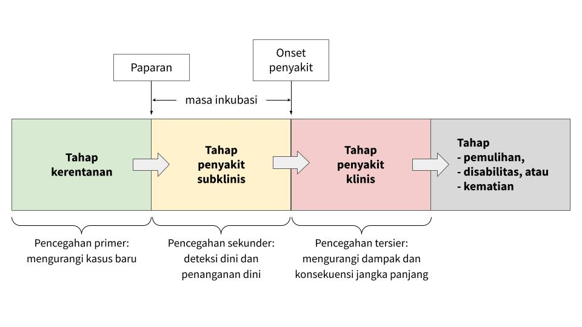
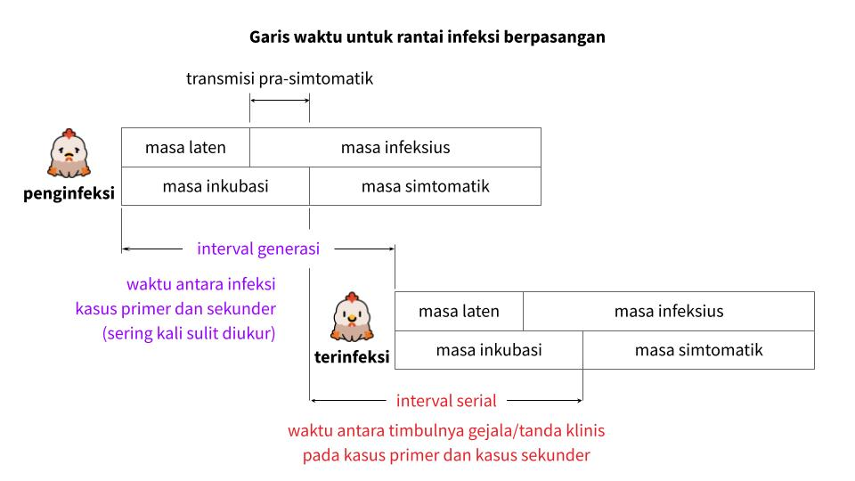
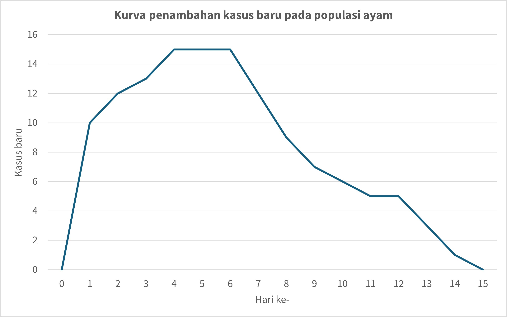
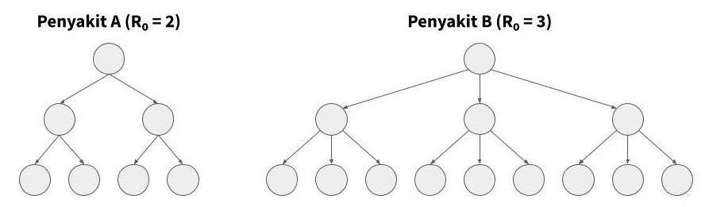

# Pekan 2

> Halaman ini berisi materi Pekan 2: Kesehatan populasi.
---
### Daftar isi
- [Populasi yang tidak sehat](pekan-2.md#populasi-yang-tidak-sehat)
  - [Konsep sehat dan tidak sehat](pekan-2.md#konsep-sehat-dan-tidak-sehat)
  - [Penyebab hewan sakit](pekan-2.md#penyebab-hewan-sakit)
  - [Perkembangan konsep tentang penyebab penyakit](pekan-2.md#perkembangan-konsep-tentang-penyebab-penyakit)
- [Model yang menggambarkan kejadian penyakit](pekan-2.md#model-yang-menggambarkan-kejadian-penyakit)
  - [Teori kuman penyakit](pekan-2.md#teori-kuman-penyakit)
  - [Penyebab multifaktorial](pekan-2.md#penyebab-multifaktorial)
  - [Segitiga epidemiologi](pekan-2.md#segitiga-epidemiologi)
  - [Riwayat alamiah penyakit](pekan-2.md#riwayat-alamiah-penyakit)
  - [Model SIR](pekan-2.md#model-sir)
  - [Kurva epidemi](pekan-2.md#kurva-epidemi)
- [Penyebaran penyakit infeksius](pekan-2.md#penyebaran-penyakit-infeksius)
  - [Tingkat penularan penyakit](pekan-2.md#tingkat-penularan-penyakit)
  - [Rantai infeksi](pekan-2.md#rantai-infeksi)
  - [Cara penularan](pekan-2.md#cara-penularan)
  - [Angka reproduksi dasar](pekan-2.md#angka-reproduksi-dasar)
  - [Kekebalan kelompok](pekan-2.md#kekebalan-kelompok)

---
### **Populasi yang tidak sehat**
---
#### **Konsep sehat dan tidak sehat**

Pada tahun 1958, Organisasi Kesehatan Dunia (WHO) mendefinisikan kesehatan sebagai "kesejahteraan fisik, mental, dan sosial yang lengkap dan bukan sekadar ketiadaan penyakit atau kelemahan".

Ini merupakan definisi yang dirumuskan untuk manusia. Bagi hewan, pada umumnya ada ekspektasi tambahan. Hewan yang sehat juga diharapkan memiliki performa yang optimal, misalnya pada aspek produksi dan reproduksinya. Hewan yang performanya tidak optimal (terutama hewan produksi) sering kali dianggap kurang sehat.

Di sisi lain, ada beberapa istilah yang menggambarkan kondisi tubuh yang tidak sehat, misalnya gejala klinis (clinical symptoms), tanda klinis (clinical signs), gangguan (disorder), penyakit (disease), cedera (injury), dan sindrom (syndrome). Tidak ada definisi resmi, misalnya dari WHO, untuk menjelaskan istilah-istilah ini. Namun, mereka dapat dijelaskan dengan ringkas sebagaimana berikut.

- **Gejala klinis**: perubahan kondisi tubuh yang mencerminkan ketidaksehatan dan dapat dikenali atau dirasakan oleh penderitanya. Dalam kedokteran hewan, istilah ini tidak digunakan karena hewan sebagai pasien tidak dapat menceritakan kondisi yang ia rasakan. Contoh: seekor anjing tidak dapat mengomunikasikan bahwa ia sedang sakit kepala.

- **Tanda klinis**: perubahan kondisi tubuh yang mencerminkan ketidaksehatan dan dapat diamati dan/atau diukur oleh pemeriksa. Contoh: demam pada kucing, kerontokan rambut pada kelinci, pincang dan pembengkakan kaki pada ayam.

- **Gangguan**: kondisi ketika aspek tertentu pada tubuh tidak berfungsi sebagaimana mestinya. Contoh: gangguan fertilitas pada sapi betina yang tidak bunting walaupun telah dikawinkan berulang kali.

- **Penyakit**: gangguan fungsi dan/atau struktur tubuh yang proses biologisnya telah dipahami. Contoh: infeksi parvovirus pada anjing, penyakit mulut dan kuku pada kambing, penyakit Newcastle pada unggas.

- **Cedera**: kerusakan pada tubuh yang diakibatkan oleh sumber eksternal. Contoh: luka robek pada kulit anjing akibat gigitan sesama anjing atau tertabrak kendaraan.

- **Sindrom**: serangkaian gejala dan tanda klinis yang muncul bersamaan dan sering kali penyebabnya tidak diketahui dengan jelas. Contoh: *fading puppy syndrome* pada anak anjing yang tiba-tiba melemah dan mati tanpa penyebab pasti yang teridentifikasi.

---

#### **Penyebab hewan sakit**

Ada banyak hal yang menyebabkan hewan yang awalnya sehat menjadi tidak sehat. Secara umum, mereka dapat diklasifikan dalam delapan kelompok sebagaimana tabel di bawah ini.

| Penyebab | Deskripsi singkat | Contoh |
|:---:|:---:|:---:|
| Infeksi dan infestasi | Invasi mikroorganisme patogenik dan/atau parasit | Panleukopenia dan infestasi pinjal pada kucing |
| Kelainan genetik | Kelainan bawaan pada DNA | Displasia pinggul pada anjing, penyakit ginjal polisistik pada kucing |
| Trauma fisik | Kerusakan tubuh akibat sumber eskternal | Kaki kuda yang patah, sapi terluka akibat kawat berduri |
| Proses degeneratif | Kemunduran fungsi jaringan secara progresif dari waktu ke waktu | Osteoartritis pada kucing, mielopati degeneratif pada anjing |
| Gangguan metabolisme | Proses biokimia yang abnormal dalam tubuh | Ketosis pada sapi perah, diabetes melitus pada anjing, obesitas pada kucing |
| Keracunan | Masuknya zat beracun ke dalam tubuh | Keracunan cokelat pada anjing, keracunan timbal pada sapi |
| Iatrogenesis | Efek buruk akibat perawatan atau intervensi medis | Infeksi pada bekas lokasi pembedahan, efek samping vaksinasi |
| Idiopati | Kondisi yang penyebabnya tidak diketahui | Sistitis idiopatik pada kucing, tremor kepala idiopatik pada anjing |

Di antara penyebab-penyebab di atas, mana yang berpotensi untuk berdampak pada banyak hewan dan/atau menyebabkan wabah penyakit, epidemi, dan pandemi? Mengapa?

**Potensi untuk menimbulkan masalah epidemiologis**

Tidak semua penyebab ketidaksehatan memiliki kemungkinan yang sama untuk menimbulkan masalah epidemiologis, seperti wabah, epidemi, atau penyebaran kasus secara luas. Tabel berikut ini merangkum potensi mereka untuk menimbulkan kejadian yang berdampak pada banyak individu dalam populasi hewan.

| Penyebab | Potensi | Keterangan |
|:---:|:---:|:---:|
| Infeksi dan infestasi | Sangat tinggi | Potensi tertinggi untuk menimbulkan masalah epidemiologis karena sifat agen infeksius dan parasit yang menular antarindividu |
| Kelainan genetik | Dapat diabaikan | Tidak menimbulkan masalah epidemiologis karena bersifat bawaan dan tidak menyebar antarindividu dalam populasi. |
| Trauma fisik | Sangat rendah | Umumnya berupa kasus tunggal; kejadian massal mungkin terjadi akibat bencana atau kecelakaan, tetapi tidak mencerminkan pola penyebaran dalam konteks epidemiologis |
| Proses degeneratif | Sangat rendah | Umumnya tidak menular dan bersifat individual, tetapi dapat menjadi masalah epidemiologis dalam populasi hewan lanjut usia |
| Gangguan metabolisme | Rendah s.d. sedang | Tidak menular, tetapi dapat menjadi masalah epidemiologis jika terjadi secara meluas akibat pola makan, manajemen, atau lingkungan yang seragam |
| Keracunan | Rendah s.d. sedang | Dapat menimbulkan masalah epidemiologis jika banyak hewan terpapar sumber racun yang sama, terutama pada peternakan atau lingkungan akuatik |
| Iatrogenesis | Sangat rendah | Biasanya terbatas pada individu yang menerima tindakan medis dan jarang terjadi pada banyak hewan |
| Idiopati | Dapat diabaikan | Tidak diketahui penyebabnya dan umumnya tidak menular sehingga tidak berpotensi menimbulkan masalah epidemiologis |

Di antara semua penyebab, infeksi dan infestasi menjadi perhatian utama dalam epidemiologi veteriner karena sifatnya yang menular dan mampu menyebar cepat dalam populasi. Meskipun beberapa penyebab lain seperti gangguan metabolisme dan keracunan juga dapat menimbulkan masalah epidemiologis pada konteks tertentu, dampaknya biasanya terbatas pada situasi atau kelompok hewan yang spesifik. Oleh karena itu, pemahaman terhadap karakteristik setiap penyebab sangat penting untuk menentukan strategi pencegahan dan pengendalian yang tepat.

---

#### **Perkembangan konsep tentang penyebab penyakit**

Sepanjang sejarah, manusia memiliki banyak konsep tentang penyebab penyakit. Berikut ini adalah beberapa konsep atau teori yang banyak dianut.

**👻 Teori supranatural** 
Penyakit disebabkan oleh roh jahat, kutukan dewa, pengaruh benda-benda langit, dan sebagainya. Konsep ini banyak dipercaya oleh kelompok-kelompok manusia yang hidup dalam budaya primitif. Contoh: influenza berasal dari bahasa Latin *influentia* karena diduga disebabkan oleh pengaruh bintang.

**💦 Teori humoral** 
Penyakit disebabkan oleh ketidakseimbangan empat humor (cairan) tubuh, yaitu darah, empedu kuning, empedu hitam, dan dahak. Konsep ini banyak dipercaya pada peradaban kuno dan dihubungkan dengan empat unsur alam (api, air, angin, dan tanah) serta empat temperamen manusia (sanguinis, koleris, melankolis, dan flegmatis).

**💩 Teori miasma** 
Penyakit disebabkan oleh miasma (partikel kotor) yang berasal dari benda-benda kotor, seperti bangkai dan materi organik lainnya yang membusuk. Contoh: malaria berasal dari bahasa Italia *mala aria* yang berarti ‘udara buruk’. Konsep ini banyak dipercaya hingga abad ke-19.

**🔬 Teori kuman penyakit** 
Penyakit disebabkan oleh mikroorganisme patogenik dan parasit. Teori ini dianut secara luas sejak penemuan bakteri patogenik dan virus pada abad ke-19. Tokoh penting yang mengembangkan teori ini antara lain adalah Louis Pasteur dan Robert Koch.

**🔢 Konsep multifaktor** 
Penyakit disebabkan oleh banyak faktor yang saling berinteraksi. Konsep ini banyak dianut pada masa modern.

Kita akan berfokus pada dua konsep terakhir, yaitu teori kuman penyakit dan multifaktor.

---
### **Model yang menggambarkan kejadian penyakit**
---
#### **Teori kuman penyakit**

Konsep dasar munculnya penyakit menurut teori kuman penyakit adalah:

🙂 inang + 🦠 agen = 🤒 penyakit

Konsep ini menguat sejak Postulat Koch dibuat pada tahun 1884. Robert Koch, seorang dokter asal Jerman, merumuskan empat kriteria untuk menetapkan hubungan kausal antara penyebab dan penyakit. Melalui postulat ini, Koch mendeskripsikan penyebab tuberkulosis, yaitu *Mycobacterium tuberculosis*. Ia lantas menerima Penghargaan Nobel dalam Fisiologi/Kedokteran pada tahun 1905 atas penemuannya ini.

<figure style="text-align: center;">
  
  <figcaption>Gambar 2.1. Diagram yang menjelaskan Postulat Koch. Sumber gambar: <a href="https://commons.wikimedia.org/wiki/File:Koch%27s_Postulates.svg" target="_blank" rel="noopener noreferrer">Wikimedia Commons</a>.</figcaption>
</figure>

Postulat Koch:
1. Suatu mikroorganisme (kausal) harus ditemukan dalam jumlah banyak pada semua organisme yang sakit tetapi tidak pada organisme yang sehat.
2. Mikroorganisme tersebut harus dapat diisolasi dari organisme yang sakit dan ditumbuhkan dalam kultur murni.
3. Mikroorganisme yang dikulturkan harus menyebabkan penyakit yang sama ketika diinokulasikan ke dalam organisme yang sehat.
4. Mikroorganisme tersebut harus diisolasi kembali dari inang yang terinfeksi secara eksperimental dan terbukti identik dengan agen penyebab aslinya.

Meskipun postulat Koch dapat digunakan untuk mengidentifikasi mikroorganisme patogenik sebagai penyebab spesifik suatu penyakit, pendekatan ini memiliki beberapa kelemahan, antara lain:
- Postulat Koch tidak dapat diterapkan pada penyakit yang tidak menular.
- Beberapa mikroorganisme patogenik tidak dapat diisolasi dan ditumbuhkan dalam kultur murni, terutama dengan teknologi yang tersedia saat itu.
- Beberapa individu bisa saja terinfeksi secara subklinis dan tidak menunjukkan tanda-tanda klinis (asimptomatik).
- Beberapa patogen menyebabkan berbagai penyakit, dan di sisi lain, beberapa penyakit dapat disebabkan oleh beberapa spesies patogen.

---

#### **Penyebab multifaktorial**

Gagasan bahwa suatu penyakit disebabkan oleh interaksi antara berbagai faktor mulai muncul pada tahun 1900-an, seiring dengan perkembangan epidemiologi modern yang menggunakan statistika.

Hal yang membedakan konsep multifaktorial dengan teori kuman penyakit adalah pertimbangan faktor-faktor lain seperti lingkungan dalam menimbulkan penyakit.

> Konsep munculnya penyakit menurut teori kuman penyakit: 
🙂 inang + 🦠 agen = 🤒 penyakit

> Konsep-awal munculnya penyakit menurut teori multifaktorial: 
🙂 inang + 🦠 agen + 🌄 lingkungan = 🤒 penyakit

Ada beberapa model yang digunakan untuk menjelaskan konsep multifaktorial, di antaranya segitiga epidemiologi, pai penyebab, jejaring penyebab, dan lingkaran determinan. Di sini, kita hanya membahas satu model, yaitu segitiga epidemiologi.

---

#### **Segitiga epidemiologi**

Segitiga epidemiologi adalah model dalam epidemiologi yang menjelaskan bahwa suatu penyakit (terutama penyakit menular) dapat muncul akibat adanya interaksi yang sesuai antara tiga komponen, yaitu inang, agen, dan lingkungan. Jika ada komponen yang tidak mendukung, maka penyakit kemungkinan besar tidak akan muncul atau menyebar lebih lanjut.

<figure style="text-align: center;">
  
  <figcaption>Gambar 2.2. Model segitiga epidemiologi.</figcaption>
</figure>

- **Inang** 
 Inang (atau penjamu) adalah organisme yang menampung agen dan menderita penyakit. Sejumlah faktor yang dimiliki inang memengaruhi kerentanannya terhadap penyakit, antara lain spesies, ras, jenis kelamin, usia, ukuran tubuh, dan status kekebalan.

- **Agen** 
 Agen adalah penyebab penyakit, yang dapat berupa patogen, bahan kimia, atau benda fisik. Faktor dari agen yang berpengaruh terhadap potensi penyakit antara lain jenis agen, dosis, virulensi, dan patogenisitas.

- **Lingkungan** 
 Lingkungan mencakup semua faktor eksternal tempat inang hidup dan terpapar agen. Faktor ini meliputi iklim (suhu, kelembaban, curah hujan), cuaca, tempat tinggal, ketersediaan pakan, dan cara pengelolaan hewan.

Ketiga komponen ini berinteraksi satu sama lain. Interaksi antarkomponen yang tepat mendukung kemunculan dan penyebaran penyakit.

- **Interaksi inang–agen** 
 Penyakit muncul ketika inang yang rentan terpapar dengan agen yang efektif. Interaksi ini bergantung pada respons imun inang dan kemampuan agen menimbulkan penyakit.

- **Interaksi inang–lingkungan** 
 Lingkungan dapat memengaruhi kesehatan inang secara umum. Kondisi hidup yang buruk dan stresor dari lingkungan dapat meningkatkan kerentanan terhadap penyakit.

- **Interaksi agen–lingkungan** 
 Lingkungan dapat memengaruhi kelangsungan hidup dan perpindahan agen. Sebagai contoh, suhu dan kelembapan dapat memengaruhi viabilitas patogen di lingkungan.

Oleh karena itu, untuk mencegah atau mengendalikan suatu penyakit, perlu sejumlah modifikasi atau intervensi setidaknya pada salah satu sisi segitiga epidemiologi, yaitu interaksi antara dua komponen.

* **Intervensi inang–agen:** 
    * Vaksinasi (meningkatkan kekebalan inang terhadap agen).
    * Pemberian antimikroba atau antiparasit (menargetkan agen dalam inang).
    * Pengembangan genetik (menghasilkan inang yang lebih resisten terhadap agen).
* **Intervensi inang–lingkungan:**
    * Peningkatan kondisi tempat tinggal (mengurangi stres pada inang akibat lingkungan yang buruk).
    * Pengaturan kepadatan hewan (mengurangi risiko penularan akibat interaksi antarinang dalam lingkungan terbatas).
    * Penyediaan pakan dan air minum yang cukup dan berkualitas (pemanfaatan sumber daya lingkungan untuk memenuhi asupan nutrisi inang).
* **Intervensi agen–lingkungan:**
    * Tindakan biosekuriti (mencegah masuk dan keluarnya agen ke dan dari suatu lingkungan).
    * Sanitasi lingkungan (mengurangi jumlah agen di lingkungan).
    * Pengendalian vektor (mencegah perpindahan agen melalui unsur lingkungan).

---

#### **Riwayat alamiah penyakit**

Riwayat alamiah penyakit adalah gambaran perjalanan suatu penyakit pada individu (baik manusia maupun hewan) seiring waktu tanpa adanya intervensi medis apa pun. Pada umumnya, penggambaran ini dimulai dari individu rentan yang belum berpenyakit hingga penyakit tersebut berakhir, baik karena individu itu sembuh atau meninggal dunia.

<figure style="text-align: center;">
  
  <figcaption>Gambar 2.3. Model riwayat alamiah penyakit.</figcaption>
</figure>

Pada penyakit infeksius, terdapat empat tahapan yang dilalui oleh individu penderitanya.

- **Tahap rentan:**  
Pada tahap ini, individu berada dalam kondisi yang memungkinkan untuk tertular jika terpapar agen penyebab penyakit.

- **Tahap penyakit subklinis:**  
Ini adalah tahap setelah individu terpapar agen penyakit. Agen sudah mulai berkembang dalam tubuh, tetapi belum menimbulkan gejala dan tanda klinis.

- **Tahap penyakit klinis:**  
Pada tahap ini, tanda-tanda penyakit sudah terlihat dan/atau gejalanya dapat dirasakan. Manifestasinya bisa ringan hingga berat, tergantung jenis penyakit dan respons tubuh.

- **Tahap pemulihan, disabilitas, atau kematian:**  
Ini adalah tahap akhir dari perjalanan penyakit, ketika hasil akhirnya bisa berupa pulih sepenuhnya, disabilitas yang bersifat permanen atau sebagian, atau kematian.

Setiap tahap penyakit dapat dikendalikan melalui tiga tingkat pencegahan berikut.

- **Pencegahan primer:**  
Upaya yang dilakukan untuk mencegah munculnya kasus baru. Contoh: vaksinasi, edukasi kesehatan, peningkatan sanitasi, promosi gaya hidup sehat.

- **Pencegahan sekunder:**  
Upaya untuk mendeteksi penyakit sedini mungkin dan memberikan pengobatan awal guna mencegah perkembangan penyakit menjadi lebih parah. Contoh: skrining, diagnosis dini, pemeriksaan laboratorium rutin. 

- **Pencegahan tersier:**  
Upaya mengurangi dampak jangka panjang penyakit, mempercepat pemulihan, mencegah kecacatan, dan meningkatkan kualitas hidup. Contoh: rehabilitasi, terapi fisik, dukungan psikososial.

Selain tahapan dan tingkat pencegahan, terdapat pula istilah lain yang sering digunakan untuk menggambarkan durasi waktu pada perjalanan penyakit.

- **Masa inkubasi:**  
Interval waktu sejak individu terpapar agen penyakit hingga munculnya gejala klinis yang pertama. 

- **Masa laten:**  
Interval waktu sejak individu terpapar agen penyakit hingga ia menjadi infeksius.

- **Masa infeksius:**  
Periode waktu ketika individu terinfeksi dapat menularkan agen penyakit ke individu lain.

- **Masa prepaten:**  
Interval waktu sejak individu terpapar parasit hingga parasit tersebut dapat dideteksi pertama kali, misalnya melalui pemeriksaan feses atau darah.

Catatan: Individu yang terinfeksi bisa saja memiliki masa laten yang lebih singkat dari masa inkubasi. Artinya, ia berpotensi menjadi sumber penularan penyakit meskipun belum menunjukkan tanda klinis. Sebaliknya, masa laten bisa lebih panjang dari masa inkubasi. Artinya, ia sudah menunjukkan tanda klinis, tetapi belum dapat menularkan penyakit ke individu lain.

Untuk memahami bagaimana perbedaan antara masa laten, masa infeksius, dan masa inkubasi memengaruhi pola penularan penyakit, perhatikan Gambar 2.4 yang mengilustrasikan garis waktu rantai infeksi antara dua individu.

<figure style="text-align: center;">
  
  <figcaption>Gambar 2.4. Model yang mengilustrasikan rantai infeksi antara dua individu.</figcaption>
</figure>

Gambar 2.4 menunjukkan individu penginfeksi dan individu terinfeksi dalam rantai penularan penyakit. Pada gambar ini, penularan bisa terjadi sebelum munculnya gejala klinis pada individu penginfeksi. Hal ini dikenal sebagai penularan (transmisi) pra-simtomatik. 

---

#### **Model SIR**

Salah satu cara untuk menggambarkan riwayat alamiah penyakit dalam suatu populasi adalah melalui model SIR. Model ini menggunakan pendekatan matematika yang membagi populasi ke dalam tiga kompartemen berdasarkan status penyakit setiap individu.

- **Susceptible (rentan):** Individu yang saat ini rentan terhadap penyakit dan dapat terinfeksi jika terpapar agen infeksius.

- **Infected (terinfeksi):** Individu yang saat ini terinfeksi dan bersifat infeksius, artinya dapat menularkan penyakit kepada individu yang rentan.

- **Recovered atau removed (sembuh atau keluar):** Individu yang tidak lagi terinfeksi karena sembuh dan menjadi kebal dan tidak lagi berperan dalam penularan penyakit.

Model SIR mengasumsikan bahwa individu mengalami perubahan status penyakit dan berpindah kompartemen secara berurutan. Pada awalnya ia rentan, kemudian terinfeksi, dan terakhir menjadi sembuh (S⟶I⟶R). 

Namun, dalam perkembangan selanjutnya, model ini dianggap terlalu sederhana untuk menjelaskan dinamika penyakit. Oleh karena itu, para ahli epidemiologi menambahkan beberapa kompartemen lain, seperti E, V, dan D.

- **Exposed (terpapar):** Individu yang telah terpapar agen penyakit, tetapi belum infeksius (penyakit berada dalam masa inkubasi).

- **Vaccinated (tervaksin):** Individu yang telah menerima vaksin dan terlindungi dari infeksi, baik berupa perlindungan sebagian atau penuh.

- **Death (mati):** Individu yang meninggal akibat penyakit.

- Kompartemen lain, seperti Quarantined (dikarantina) dan Hospitalized (dirawat), tergantung kebutuhan analisis.

Dengan adanya kompartemen-kompartemen baru ini, model SIR dapat berkembang menjadi SIRD, SEIRD, SVEIRD, atau bentuk lainnya. 

Berikut ini contoh dinamika penyebaran penyakit pada ayam berdasarkan model SIRD. Perhatikan bahwa setiap hari, jumlah populasi tetap konstan, yaitu 1000.

| Hari | Rentan (S) | Terinfeksi (I) | Sembuh (R) | Mati (D) |
| :--: | :--------: | :------------: | :--------: | :------: |
|   0  |    1000    |        0       |      0     |     0    |
|   1  |     990    |       10       |      0     |     0    |
|   2  |     978    |       18       |      2     |     2    |
|   3  |     965    |       24       |      7     |     4    |
|   4  |     950    |       30       |     14     |     6    |
|   5  |     935    |       35       |     24     |     6    |

Dari tabel di atas, kita dapat melihat bagaimana jumlah individu dalam setiap kompartemen berubah dari hari ke hari. Pola perubahan ini mencerminkan dinamika penyebaran penyakit dalam populasi dan dapat digunakan sebagai dasar untuk membuat kurva epidemi. 

---

#### **Kurva epidemi**

Kurva epidemi adalah grafik yang menggambarkan jumlah kasus penyakit dari waktu ke waktu dalam suatu populasi. Grafik ini digunakan untuk memvisualisasikan pola kejadian penyakit, termasuk bagaimana jumlah kasus dapat meningkat, mencapai puncak, dan kemudian menurun. Kurva ini sangat berguna terutama dalam situasi wabah, tetapi juga dapat diterapkan dalam pemantauan penyakit endemik atau musiman.

Pada kurva epidemi, sumbu X selalu menunjukkan waktu, seperti hari, pekan, atau bulan. Sementara itu, sumbu Y biasanya menunjukkan jumlah individu, dan dapat diisi oleh berbagai jenis variabel, tergantung pada tujuan analisis.

Berikut ini beberapa variabel yang umum digunakan pada sumbu Y dalam kurva epidemiologi:
- **Jumlah kasus baru (insidensi)**, untuk menunjukkan kecepatan penyebaran penyakit dan waktu terjadinya puncak kasus. Ini adalah variabel yang paling sering digunakan pada sumbu Y kurva epidemiologi.
- **Jumlah kasus aktif**, untuk menggambarkan beban penyakit yang sedang berlangsung pada suatu waktu.
- **Jumlah kasus kumulatif**, untuk menunjukkan total dampak penyakit sejak awal hingga waktu tertentu.
- **Jumlah kematian baru**, untuk menunjukkan laju kematian dari waktu ke waktu dan mengidentifikasi periode paling mematikan dari penyakit.
- **Jumlah kematian kumulatif**, untuk memperlihatkan total kasus kematian akibat penyakit hingga waktu tertentu, mencerminkan dampak keseluruhan terhadap populasi.
- **Jumlah kesembuhan kumulatif**, untuk menggambarkan pemulihan dalam populasi dan efektivitas penanganan.

Mari kita buat kurva epidemiologi dari tabel SIRD. Pada tabel di bawah ini, kolom I menunjukkan jumlah kasus aktif, kolom R menunjukkan jumlah kesembuhan kumulatif, dan kolom D menunjukkan jumlah kematian kumulatif. Kita memerlukan satu tambahan kolom lagi, yaitu jumlah kasus baru. Setiap baris pada kolom ini didapatkan dengan cara mengurangi jumlah hewan rentan pada hari sebelumnya dengan jumlah hewan rentan pada hari ini. 

Jumlah kasus baru pada hari ke-n = 

| Hari | Rentan (S) | Terinfeksi (I) | Sembuh (R) | Mati (D) | Kasus Baru |
|:----:|:----------:|:--------------:|:----------:|:--------:|:----------:|
|  0   |    1000    |       0        |     0      |    0     |      0     |
|  1   |     990    |      10        |     0      |    0     |     10     |
|  2   |     978    |      18        |     2      |    2     |     12     |
|  3   |     965    |      24        |     7      |    4     |     13     |
|  4   |     950    |      30        |    14      |    6     |     15     |
|  5   |     935    |      35        |    24      |    6     |     15     |
|  6   |     920    |      37        |    33      |   10     |     15     |
|  7   |     908    |      36        |    39      |   17     |     12     |
|  8   |     899    |      33        |    45      |   23     |      9     |
|  9   |     892    |      30        |    53      |   25     |      7     |
| 10   |     886    |      28        |    60      |   26     |      6     |
| 11   |     881    |      28        |    65      |   26     |      5     |
| 12   |     876    |      26        |    72      |   26     |      5     |
| 13   |     873    |      24        |    77      |   26     |      3     |
| 14   |     872    |      20        |    82      |   26     |      1     |
| 15   |     872    |      17        |    85      |   26     |      0     |

Setelah mengetahui jumlah penambahan kasus baru per hari, kita dapat membuat kurva epideminya.

<figure style="text-align: center;">
  
  <figcaption>Gambar 2.5. Kurva penambahan kasus baru.</figcaption>
</figure>

---
### **Penyebaran penyakit infeksius**
---

#### **Tingkat penularan penyakit**

Penyakit satu dan penyakit lainnya memiliki tingkat penularan yang bervariasi. Kita telah mengetahui bahwa penyakit adalah gangguan fungsi dan/atau struktur tubuh yang proses biologisnya telah dipahami. Secara garis besar, penyakit dapat diklasifikasikan menjadi penyakit infeksius dan penyakit noninfeksius.

**Penyakit infeksius** adalah penyakit yang disebabkan oleh mikroorganisme patogenik seperti bakteri, virus, atau parasit yang dapat tumbuh dan berkembang biak di dalam tubuh inang. Penyakit infeksius dapat diklasifikasikan menjadi infeksi yang bersifat individual (misalnya infeksi rongga mulut dan gigi atau infeksi pada luka terbuka) dan penyakit infeksius yang menular.

**Penyakit menular** (contagious atau transmissible diseases) adalah penyakit yang dapat berpindah dari satu individu ke individu lain. Penyakit menular dapat diklasifikasikan menjadi penyakit yang penularannya terbatas (misalnya pink eye dan koksidiosis) dan penyakit lintas batas.

**Penyakit lintas batas**  (transboundary diseases) adalah penyakit dapat menyebar dengan cepat antarwilayah atau antarnegara, serta menimbulkan dampak ekonomi dan sosial yang signifikan, khususnya dalam konteks perdagangan internasional.

---

#### **Rantai infeksi**

Untuk memahami bagaimana penyakit menular menyebar dalam suatu populasi, kita dapat menggunakan konsep rantai infeksi. Rantai infeksi adalah model yang menjelaskan bagaimana agen infeksius berpindah dari satu individu atau satu sumber ke individu lainnya. Penyebaran ini terjadi melalui serangkaian komponen yang saling terhubung dan membentuk suatu siklus penularan.

<figure style="text-align: center;">
  
  <figcaption>Gambar 2.6. Model rantai infeksi.</figcaption>
</figure>

Gambar 2.6 mengilustrasikan komponen utama dalam rantai infeksi:
- **Agen infeksius**: mikroorganisme penyebab penyakit, seperti virus, bakteri, atau parasit.
- **Reservoir atau inang terinfeksi**: tempat hidup dan berkembangnya agen infeksius, yang bisa berupa manusia, hewan, atau objek di lingkungan.
- **Portal keluar**: jalur keluarnya agen infeksi dari inang terinfeksi, seperti cairan tubuh, feses, atau percikan napas.
- **Cara penularan**: cara agen berpindah dari sumber ke individu lain, misalnya melalui kontak langsung, udara (aerosol), makanan, atau vektor seperti nyamuk.
- **Portal masuk**: jalur masuknya agen ke inang baru, seperti saluran pernapasan, saluran pencernaan, atau kulit yang terluka.
- **Inang rentan**: individu yang tidak memiliki kekebalan dan rentan terinfeksi.

---

#### **Cara penularan**

Cara penularan (disebut juga jalur atau rute penularan) adalah mekanisme perpindahan agen infeksius dari suatu sumber atau dari inang terinfeksi ke inang rentan. 

Secara umum, cara penularan dibagi menjadi dua kategori utama:

* **Penularan vertikal**: 
Terjadi ketika agen infeksius ditularkan dari induk ke keturunannya, biasanya melalui plasenta, selama proses kelahiran, atau melalui air susu.

* **Penularan horizontal**: 
Merupakan penularan dari satu individu ke individu lain yang tidak berada dalam hubungan induk dan anak. Penularan ini dibagi lagi menjadi dua jenis:
    * **Penularan langsung**: 
      Agen infeksi berpindah secara langsung tanpa perantara. Ini dapat terjadi melalui:
      * **Kontak fisik**, seperti melalui kulit, membran mukosa, luka terbuka, atau hubungan seksual.
      * **Aerosol**, yaitu partikel halus yang terhirup saat dua individu berada di tempat dan waktu yang sama, seperti saat bersin atau batuk.  
    * **Penularan tidak langsung**: 
      Terjadi ketika agen infeksi berpindah melalui media atau perantara. Penularan ini bisa melibatkan:
      * **Fomit**, yaitu benda mati yang terkontaminasi seperti peralatan, pakaian, atau kandang.
      * **Airborne**, partikel kecil yang melayang di udara dan bisa bertahan cukup lama.
      * **Foodborne**, melalui makanan yang tercemar.
      * **Waterborne**, melalui air yang tercemar.
      * **Vectorborne**, melalui perantara biologis seperti serangga.

Pemahaman tentang berbagai jalur penularan ini penting untuk mencegah dan mengendalikan penyakit. Intervensi yang tepat dapat dilakukan pada titik-titik kritis dalam rantai penularan.

---

#### **Angka reproduksi dasar**

**Angka reproduksi dasar** (disimbolkan sebagai R₀) adalah perkiraan jumlah infeksi sekunder yang diakibatkan oleh satu individu terinfeksi pada populasi yang seluruhnya rentan. Lihat Gambar 2.7 sebagai contoh, jika penyakit A memiliki R₀ = 2, maka satu individu yang terinfeksi penyakit A dapat menularkan penyakit tersebut kepada dua individu rentan lainnya. Begitu pula dengan penyakit B yang memiliki R₀ = 3. Satu individu yang terinfeksi penyakit B dapat menularkan penyakit ini kepada tiga individu yang rentan terhadap penyakit ini.

<figure style="text-align: center;">
  
  <figcaption>Gambar 2.7. Ilustrasi dua penyakit. Penyakit A memiliki R₀ = 2, sedangkan penyakit B memiliki R₀ = 3.</figcaption>
</figure>

Perlu diingat bahwa R₀ mengasumsikan bahwa semua populasi rentan dan tidak ada intervensi lain (seperti isolasi, karantina, atau vaksinasi) yang dilakukan untuk mengendalikan penyebaran penyakit.

Catatan:
* R₀ bukanlah konstanta biologis untuk patogen karena ia juga dipengaruhi oleh faktor-faktor lain seperti kondisi lingkungan dan perilaku populasi yang terinfeksi.
* R₀ menunjukkan potensi penyebaran penyakit dalam suatu populasi. Ia bukan ukuran keparahan penyakit menular atau kecepatan penyebaran patogen dalam suatu populasi.
* Jika R₀ lebih besar dari 1, penyakit akan meningkat sehingga berpotensi menjadi epidemi.
* Jika R₀ kurang dari 1, penyakit akan menurun dan akhirnya menghilang karena setiap individu yang terinfeksi rata-rata menularkan penyakit kepada kurang dari satu individu lainnya.
* R₀ membantu menentukan ambang batas kekebalan kelompok (dijelaskan di bawah), yaitu proporsi populasi yang harus diimunisasi untuk mencapai kekebalan kelompok dan secara efektif menghentikan penularan penyakit.
* Ambang batas kekebalan kelompok dapat diperkirakan sebagai: 1 − 1/R₀

---

#### **Kekebalan kelompok**

**Kekebalan kelompok** atau **kekebalan kawanan** merupakan bentuk perlindungan tidak langsung dari penyakit menular yang terjadi ketika sebagian besar populasi menjadi kebal terhadap suatu infeksi sehingga individu yang tidak kebal juga terlindungi. 

Sebagai contoh, untuk melindungi suatu populasi dari penyakit X, sebanyak 80% populasi harus menjadi kebal terhadap penyakit tersebut, baik akibat infeksi alami ataupun vaksinasi. Jika angka ini tercapai, maka penularan penyakit otomatis terhenti meskipun 20% anggota populasi tidak kebal terhadap penyakit X.

---

## Referensi

Koch, R. (1884). "<a href="https://books.google.co.id/books?id=Y6lQAAAAYAAJ&pg=PA1&redir_esc=y" target="_blank" rel="noopener noreferrer">Die Aetiologie der Tuberkulose</a>" [The etiology of tuberculosis]. Mittheilungen aus dem Kaiserlichen Gesundheitsamte (Reports from the Imperial Office of Public Health). 2: 1–88.

Frost, W.H. (1976). <a href="https://doi.org/10.1093/oxfordjournals.aje.a112212" target="_blank" rel="noopener noreferrer">Some Conceptions of Epidemics in General</a>. American Journal of Epidemiology, 103(2): 141–151
