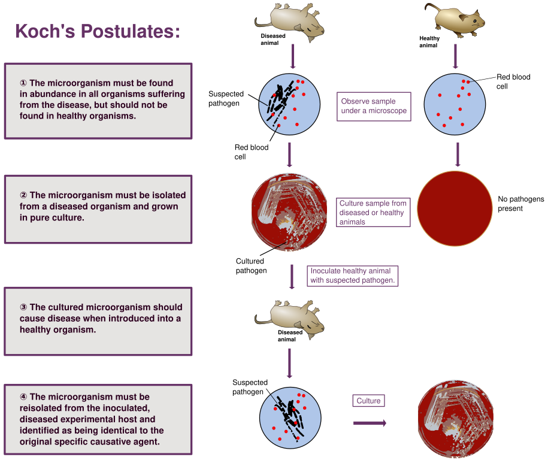
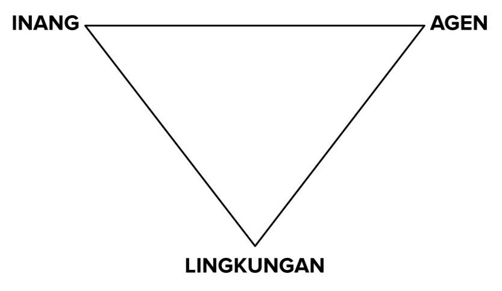

# Pekan 2

> Halaman ini berisi materi Pekan 2: Kesehatan populasi.

##### **Konsep sehat dan tidak sehat**

Pada tahun 1958, Organisasi Kesehatan Dunia (WHO) mendefinisikan kesehatan sebagai "kesejahteraan fisik, mental, dan sosial yang lengkap dan bukan sekadar ketiadaan penyakit atau kelemahan".

Ini merupakan definisi yang dirumuskan untuk manusia. Bagi hewan, pada umumnya ada ekspektasi tambahan. Hewan yang sehat juga diharapkan memiliki performa yang optimal, misalnya pada aspek produksi dan reproduksinya. Hewan yang performanya tidak optimal (terutama hewan produksi) sering kali dianggap kurang sehat.

Di sisi lain, ada beberapa istilah yang menggambarkan kondisi tubuh yang tidak sehat, misalnya gejala klinis (*clinical symptoms*), tanda klinis (*clinical signs*), gangguan (*disorder*), penyakit (*disease*), cedera (*injury*), dan sindrom (*syndrome*). Tidak ada definisi resmi, misalnya dari WHO, untuk menjelaskan istilah-istilah ini. Namun, mereka dapat dijelaskan dengan ringkas sebagaimana berikut.

- **Gejala klinis**: perubahan kondisi tubuh yang mencerminkan ketidaksehatan dan dapat dikenali atau dirasakan oleh penderitanya. Dalam kedokteran hewan, istilah ini tidak digunakan karena hewan sebagai pasien tidak dapat menceritakan kondisi yang ia rasakan. Contoh: seekor anjing tidak dapat mengomunikasikan bahwa ia sedang sakit kepala.

- **Tanda klinis**: perubahan kondisi tubuh yang mencerminkan ketidaksehatan dan dapat diamati dan/atau diukur oleh pemeriksa. Contoh: demam pada kucing, kerontokan rambut pada kelinci, pincang dan pembengkakan kaki pada ayam.

- **Gangguan**: kondisi ketika aspek tertentu pada tubuh tidak berfungsi sebagaimana mestinya. Contoh: gangguan fertilitas pada sapi betina yang tidak bunting walaupun telah dikawinkan berulang kali.

- **Penyakit**: gangguan fungsi dan/atau struktur tubuh yang proses biologisnya telah dipahami. Contoh: infeksi parvovirus pada anjing, penyakit mulut dan kuku pada kambing, penyakit Newcastle pada unggas.

- **Cedera**: kerusakan pada tubuh yang diakibatkan oleh sumber eksternal. Contoh: luka robek pada kulit anjing akibat gigitan sesama anjing atau tertabrak kendaraan.

- **Sindrom**: serangkaian gejala dan tanda klinis yang muncul bersamaan dan sering kali penyebabnya tidak diketahui dengan jelas. Contoh: *fading puppy syndrome* pada anak anjing yang tiba-tiba melemah dan mati tanpa penyebab pasti yang teridentifikasi.

---

##### **Penyebab hewan sakit**

Ada banyak hal yang menyebabkan hewan yang awalnya sehat menjadi tidak sehat. Secara umum, mereka dapat diklasifikan dalam delapan kelompok sebagaimana tabel di bawah ini.

| Penyebab | Deskripsi singkat | Contoh |
|:---:|:---:|:---:|
| Infeksi dan infestasi | Invasi mikroorganisme patogenik dan/atau parasit | Panleukopenia dan infestasi pinjal pada kucing |
| Kelainan genetik | Kelainan bawaan pada DNA | Displasia pinggul pada anjing, penyakit ginjal polisistik pada kucing |
| Trauma fisik | Kerusakan tubuh akibat sumber eskternal | Kaki kuda yang patah, sapi terluka akibat kawat berduri |
| Proses degeneratif | Kemunduran fungsi jaringan secara progresif dari waktu ke waktu | Osteoartritis pada kucing, mielopati degeneratif pada anjing |
| Gangguan metabolisme | Proses biokimia yang abnormal dalam tubuh | Ketosis pada sapi perah, diabetes melitus pada anjing, obesitas pada kucing |
| Keracunan | Masuknya zat beracun ke dalam tubuh | Keracunan cokelat pada anjing, keracunan timbal pada sapi |
| Iatrogenesis | Efek buruk akibat perawatan atau intervensi medis | Infeksi pada bekas lokasi pembedahan, efek samping vaksinasi |
| Idiopati | Kondisi yang penyebabnya tidak diketahui | Sistitis idiopatik pada kucing, tremor kepala idiopatik pada anjing |

Di antara penyebab-penyebab di atas, mana yang berpotensi untuk berdampak pada banyak hewan dan/atau menyebabkan wabah penyakit, epidemi, dan pandemi? Mengapa?

**Potensi untuk menimbulkan masalah epidemiologis**

Tidak semua penyebab ketidaksehatan memiliki kemungkinan yang sama untuk menimbulkan masalah epidemiologis, seperti wabah, epidemi, atau penyebaran kasus secara luas. Tabel berikut ini merangkum potensi mereka untuk menimbulkan kejadian yang berdampak pada banyak individu dalam populasi hewan.

| Penyebab | Potensi | Keterangan |
|:---:|:---:|:---:|
| Infeksi dan infestasi | Sangat tinggi | Potensi tertinggi untuk menimbulkan masalah epidemiologis karena sifat agen infeksius dan parasit yang menular antarindividu |
| Kelainan genetik | Dapat diabaikan | Tidak menimbulkan masalah epidemiologis karena bersifat bawaan dan tidak menyebar antarindividu dalam populasi. |
| Trauma fisik | Sangat rendah | Umumnya berupa kasus tunggal; kejadian massal mungkin terjadi akibat bencana atau kecelakaan, tetapi tidak mencerminkan pola penyebaran dalam konteks epidemiologis |
| Proses degeneratif | Sangat rendah | Umumnya tidak menular dan bersifat individual, tetapi dapat menjadi masalah epidemiologis dalam populasi hewan lanjut usia |
| Gangguan metabolisme | Rendah s.d. sedang | Tidak menular, tetapi dapat menjadi masalah epidemiologis jika terjadi secara meluas akibat pola makan, manajemen, atau lingkungan yang seragam |
| Keracunan | Rendah s.d. sedang | Dapat menimbulkan masalah epidemiologis jika banyak hewan terpapar sumber racun yang sama, terutama pada peternakan atau lingkungan akuatik |
| Iatrogenesis | Sangat rendah | Biasanya terbatas pada individu yang menerima tindakan medis dan jarang terjadi pada banyak hewan |
| Idiopati | Dapat diabaikan | Tidak diketahui penyebabnya dan umumnya tidak menular sehingga tidak berpotensi menimbulkan masalah epidemiologis |

Di antara semua penyebab, infeksi dan infestasi menjadi perhatian utama dalam epidemiologi veteriner karena sifatnya yang menular dan mampu menyebar cepat dalam populasi. Meskipun beberapa penyebab lain seperti gangguan metabolisme dan keracunan juga dapat menimbulkan masalah epidemiologis pada konteks tertentu, dampaknya biasanya terbatas pada situasi atau kelompok hewan yang spesifik. Oleh karena itu, pemahaman terhadap karakteristik setiap penyebab sangat penting untuk menentukan strategi pencegahan dan pengendalian yang tepat.

---

##### **Perkembangan konsep tentang penyebab penyakit**

Sepanjang sejarah, manusia memiliki banyak konsep tentang penyebab penyakit. Berikut ini adalah beberapa konsep atau teori yang banyak dianut.

**👻 Teori supranatural** 
Penyakit disebabkan oleh roh jahat, kutukan dewa, pengaruh benda-benda langit, dan sebagainya. Konsep ini banyak dipercaya oleh kelompok-kelompok manusia yang hidup dalam budaya primitif. Contoh: influenza berasal dari bahasa Latin *influentia* karena diduga disebabkan oleh pengaruh bintang.

**💦 Teori humoral** 
Penyakit disebabkan oleh ketidakseimbangan empat humor (cairan) tubuh, yaitu darah, empedu kuning, empedu hitam, dan dahak. Konsep ini banyak dipercaya pada peradaban kuno dan dihubungkan dengan empat unsur alam (api, air, angin, dan tanah) serta empat temperamen manusia (sanguinis, koleris, melankolis, dan flegmatis).

**💩 Teori miasma** 
Penyakit disebabkan oleh miasma (partikel kotor) yang berasal dari benda-benda kotor, seperti bangkai dan materi organik lainnya yang membusuk. Contoh: malaria berasal dari bahasa Italia *mala aria* yang berarti ‘udara buruk’. Konsep ini banyak dipercaya hingga abad ke-19.

**🔬 Teori kuman penyakit** 
Penyakit disebabkan oleh mikroorganisme patogenik dan parasit. Teori ini dianut secara luas sejak penemuan bakteri patogenik dan virus pada abad ke-19. Tokoh penting yang mengembangkan teori ini antara lain adalah Louis Pasteur dan Robert Koch.

**🔢 Konsep multifaktor** 
Penyakit disebabkan oleh banyak faktor yang saling berinteraksi. Konsep ini banyak dianut pada masa modern.

Kita akan berfokus pada dua konsep terakhir, yaitu teori kuman penyakit dan multifaktor.

---

##### **Teori kuman penyakit**

Konsep dasar munculnya penyakit menurut teori kuman penyakit adalah:

🙂 inang + 🦠 agen = 🤒 penyakit

Konsep ini menguat sejak Postulat Koch dibuat pada tahun 1884. Robert Koch, seorang dokter asal Jerman, merumuskan empat kriteria untuk menetapkan hubungan kausal antara penyebab dan penyakit. Melalui postulat ini, Koch mendeskripsikan penyebab tuberkulosis, yaitu *Mycobacterium tuberculosis*. Ia lantas menerima Penghargaan Nobel dalam Fisiologi/Kedokteran pada tahun 1905 atas penemuannya ini.

<figure style="text-align: center;">
  
  <figcaption>Gambar 2.1. Diagram yang menjelaskan Postulat Koch. Sumber gambar: <a href="https://commons.wikimedia.org/wiki/File:Koch%27s_Postulates.svg" target="_blank" rel="noopener noreferrer">Wikimedia Commons</a>.</figcaption>
</figure>

Postulat Koch:
1. Suatu mikroorganisme (kausal) harus ditemukan dalam jumlah banyak pada semua organisme yang sakit tetapi tidak pada organisme yang sehat.
2. Mikroorganisme tersebut harus dapat diisolasi dari organisme yang sakit dan ditumbuhkan dalam kultur murni.
3. Mikroorganisme yang dikulturkan harus menyebabkan penyakit yang sama ketika diinokulasikan ke dalam organisme yang sehat.
4. Mikroorganisme tersebut harus diisolasi kembali dari inang yang terinfeksi secara eksperimental dan terbukti identik dengan agen penyebab aslinya.

Meskipun postulat Koch dapat digunakan untuk mengidentifikasi mikroorganisme patogenik sebagai penyebab spesifik suatu penyakit, pendekatan ini memiliki beberapa kelemahan, antara lain:
- Postulat Koch tidak dapat diterapkan pada penyakit yang tidak menular.
- Beberapa mikroorganisme patogenik tidak dapat diisolasi dan ditumbuhkan dalam kultur murni, terutama dengan teknologi yang tersedia saat itu.
- Beberapa individu bisa saja terinfeksi secara subklinis dan tidak menunjukkan tanda-tanda klinis (asimptomatik).
- Beberapa patogen menyebabkan berbagai penyakit, dan di sisi lain, beberapa penyakit dapat disebabkan oleh beberapa spesies patogen.

---

##### **Penyebab multifaktorial**

Gagasan bahwa suatu penyakit disebabkan oleh interaksi antara berbagai faktor mulai muncul pada tahun 1900-an, seiring dengan perkembangan epidemiologi modern yang menggunakan statistika.

Hal yang membedakan konsep multifaktorial dengan teori kuman penyakit adalah pertimbangan faktor-faktor lain seperti lingkungan dalam menimbulkan penyakit.

> Konsep munculnya penyakit menurut teori kuman penyakit: 
🙂 inang + 🦠 agen = 🤒 penyakit

> Konsep-awal munculnya penyakit menurut teori multifaktorial: 
🙂 inang + 🦠 agen + 🌄 lingkungan = 🤒 penyakit

Ada beberapa model yang digunakan untuk menjelaskan konsep multifaktorial, di antaranya segitiga epidemiologi, pai penyebab, jejaring penyebab, dan lingkaran determinan. Di sini, kita hanya membahas satu model, yaitu segitiga epidemiologi.

---

##### **Segitiga epidemiologi**

Segitiga epidemiologi adalah model dalam epidemiologi yang menjelaskan bahwa suatu penyakit (terutama penyakit menular) dapat muncul akibat adanya interaksi yang sesuai antara tiga komponen, yaitu inang, agen, dan lingkungan. Jika ada komponen yang tidak mendukung, maka penyakit kemungkinan besar tidak akan muncul atau menyebar lebih lanjut.

<figure style="text-align: center;">
  
  <figcaption>Gambar 2.2. Model segitiga epidemiologi.</figcaption>
</figure>

- **Inang** 
 Inang (atau penjamu) adalah organisme yang menampung agen dan menderita penyakit. Sejumlah faktor yang dimiliki inang memengaruhi kerentanannya terhadap penyakit, antara lain spesies, ras, jenis kelamin, usia, ukuran tubuh, dan status kekebalan.

- **Agen** 
 Agen adalah penyebab penyakit, yang dapat berupa patogen, bahan kimia, kekuatan fisik, atau kekurangan nutrisi. Faktor dari agen yang berpengaruh terhadap potensi penyakit antara lain jenis agen, dosis, virulensi, dan patogenisitas.

- **Lingkungan** 
 Lingkungan mencakup semua faktor eksternal tempat inang hidup dan terpapar agen. Faktor ini meliputi iklim (suhu, kelembaban, curah hujan), cuaca, tempat tinggal, ketersediaan pakan, dan cara pengelolaan hewan.

Ketiga komponen ini berinteraksi satu sama lain. Interaksi antarkomponen yang tepat mendukung kemunculan dan penyebaran penyakit.

- **Interaksi inang–agen** 
 Penyakit muncul ketika inang yang rentan terpapar dengan agen yang efektif. Interaksi ini bergantung pada respons imun inang dan kemampuan agen menimbulkan penyakit.

- **Interaksi inang–lingkungan** 
 Lingkungan dapat memengaruhi kesehatan inang secara umum. Kondisi hidup yang buruk dan stresor dari lingkungan dapat meningkatkan kerentanan terhadap penyakit.

- **Interaksi agen–lingkungan** 
 Lingkungan dapat memengaruhi kelangsungan hidup dan perpindahan agen. Sebagai contoh, suhu dan kelembapan dapat memengaruhi viabilitas patogen di lingkungan.

Oleh karena itu, untuk mencegah atau mengendalikan suatu penyakit, perlu sejumlah modifikasi atau intervensi setidaknya pada salah satu sisi segitiga epidemiologi, yaitu interaksi antara dua komponen.

* **Intervensi inang–agen:** 
    * Vaksinasi (meningkatkan kekebalan inang terhadap agen).
    * Pemberian antimikroba atau antiparasit (menargetkan agen dalam inang).
    * Pengembangan genetik (menghasilkan inang yang lebih resisten terhadap agen).
* **Intervensi inang–lingkungan:**
    * Peningkatan kondisi tempat tinggal (mengurangi stres pada inang akibat lingkungan yang buruk).
    * Pengaturan kepadatan hewan (mengurangi risiko penularan akibat interaksi antarinang dalam lingkungan terbatas).
    * Penyediaan pakan dan air minum yang cukup dan berkualitas (pemanfaatan sumber daya lingkungan untuk memenuhi asupan nutrisi inang).
* **Intervensi agen–lingkungan:**
    * Tindakan biosekuriti (mencegah masuk dan keluarnya agen dari suatu lingkungan).
    * Sanitasi lingkungan (mengurangi jumlah agen di lingkungan).
    * Pengendalian vektor (mencegah perpindahan agen melalui unsur lingkungan).

---

##### **Riwayat alamiah penyakit**

Riwayat alamiah penyakit adalah gambaran perjalanan suatu penyakit pada individu seiring waktu tanpa adanya intervensi medis apa pun. Pada umumnya, penggambaran ini dimulai dari individu rentan yang belum berpenyakit hingga penyakit tersebut berakhir, baik karena individu itu sembuh, mengalami disabilitas, atau meninggal dunia.

---

Referensi

Koch, R. (1884). "<a href="https://books.google.co.id/books?id=Y6lQAAAAYAAJ&pg=PA1&redir_esc=y" target="_blank" rel="noopener noreferrer">Die Aetiologie der Tuberkulose</a>" [The etiology of tuberculosis]. Mittheilungen aus dem Kaiserlichen Gesundheitsamte (Reports from the Imperial Office of Public Health). 2: 1–88.

Frost, W.H. (1976). <a href="https://doi.org/10.1093/oxfordjournals.aje.a112212" target="_blank" rel="noopener noreferrer">Some Conceptions of Epidemics in General</a>. American Journal of Epidemiology, 103(2): 141–151
